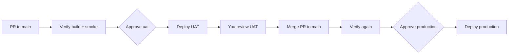

# UAT & production deployment

Two-stage deploy with **manual approval** in GitHub Actions.

## Flow



| Stage | Trigger | GitHub Environment | Cloudflare target |
|-------|---------|-------------------|-------------------|
| **Verify** | PR or push to `main` | — | Local smoke only |
| **Stage 1 — UAT** | PR to `main` | `uat` (required reviewers) | Pages project `cloudflare-starter-hub-uat` |
| **Stage 2 — Production** | Push to `main` (after merge) | `production` (required reviewers) | Pages project `cloudflare-starter-hub` → `onboarding.orangecloud.vn` |

Workflow file: [`.github/workflows/deploy.yml`](../.github/workflows/deploy.yml)

## One-time setup

### 1. Cloudflare Pages — UAT project

```bash
# Create UAT project (once)
npx wrangler pages project create cloudflare-starter-hub-uat --production-branch=main
```

Optional custom domain: **`onboarding-uat.orangecloud.vn`** → UAT Pages project.  
Protect only **`/workshop/admin`** with Access (not the whole hostname). See [WORKSHOP-ADMIN-ACCESS.md](../WORKSHOP-ADMIN-ACCESS.md).

Copy **Production** bindings from `cloudflare-starter-hub` (D1, KV, R2, AI) or use separate UAT resources if you prefer isolation.

### 2. GitHub Secrets

Repository → **Settings → Secrets and variables → Actions → Secrets**

| Secret | Purpose |
|--------|---------|
| `CLOUDFLARE_API_TOKEN` | API token with **Cloudflare Pages — Edit** (+ Account read) |
| `CLOUDFLARE_ACCOUNT_ID` | Cloudflare account ID |

### 3. GitHub Variables (optional)

**Settings → Secrets and variables → Actions → Variables**

| Variable | Default | Purpose |
|----------|---------|---------|
| `CF_PAGES_PROJECT_UAT` | `cloudflare-starter-hub-uat` | UAT Pages project name |
| `CF_PAGES_PROJECT_PROD` | `cloudflare-starter-hub` | Production Pages project |
| `PUBLIC_SITE_URL_UAT` | `https://uat.onboarding.orangecloud.vn` | Canonical URL for UAT builds |

### 4. GitHub Environments (approval gates)

**Settings → Environments**

#### Environment: `uat`

- **Required reviewers:** you (and anyone else who may approve UAT)
- Optional: deployment branch rule → `main` only

#### Environment: `production`

- **Required reviewers:** you (production approvers)
- Recommended: **wait timer** 0 min, restrict to `main` branch

When a deploy job reaches an environment, GitHub shows **Review pending deployments** — click **Approve and deploy**.

## Day-to-day

### PR → UAT

1. Contributor opens PR to `main`.
2. **Verify PR** and **Deploy → Verify build** run automatically.
3. **Deploy → Stage 1 — UAT** waits for your approval.
4. Approve in GitHub: **Actions → Deploy run → Review deployments → Approve**.
5. UAT deploys; a comment on the PR includes the preview URL (`pr-<number>.…pages.dev` or custom UAT domain).

New commits on the PR require **UAT approval again** (by design).

### Merge → Production

1. After UAT looks good, merge PR to `main`.
2. **Deploy → Stage 2 — Production** runs and waits for **production** approval.
3. Approve → deploy to `cloudflare-starter-hub` / `onboarding.orangecloud.vn`.
4. Smoke tests run against Pages URL and custom domain.

### Manual redeploy

**Actions → Deploy → Run workflow**

- **target:** `uat` or `production`
- **ref:** branch or SHA (default `main`)

## Local commands

```bash
npm run deploy          # production (maintainer machine)
npm run deploy:verify   # smoke production domains
```

CI uses the same build (`npm run build`) and smoke script as local verify.

## Troubleshooting

| Issue | Fix |
|-------|-----|
| UAT job skipped | Only runs on `pull_request` to `main` |
| Stuck on “Waiting for approval” | Settings → Environments → add yourself as reviewer |
| Wrangler auth error | Check `CLOUDFLARE_API_TOKEN` permissions |
| UAT APIs fail | Add D1/KV/R2 bindings to UAT Pages project (mirror production) |
| Production deploy without UAT | Environments are independent — process: always approve UAT on PR before merging |
